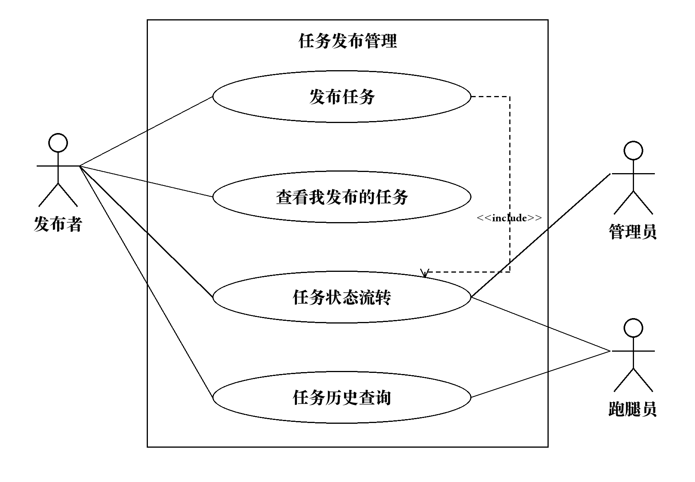
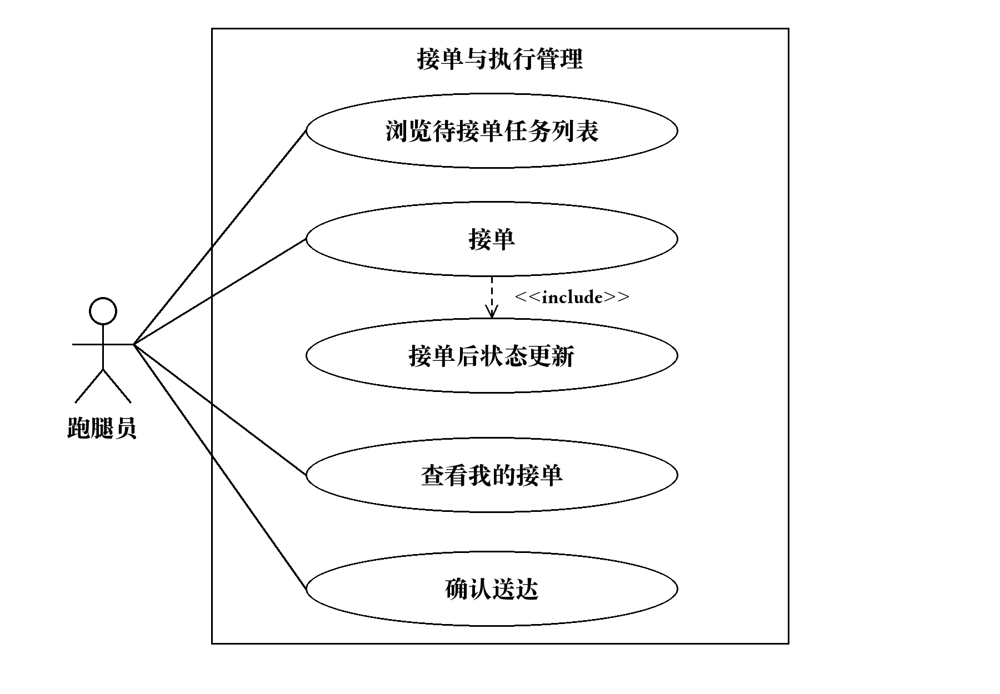

# 王宏涛负责的需求分析章节

本文对应《校园跑腿系统需求分析_邱禾勋小组.doc》的 3.3.2、3.3.3 节，保留原有九个系统需求编号，作为 Word 正文的可审阅文本及合并依据。正文中的身份均由登录态确定，不接受客户端指定他人的用户编号作为授权依据。

## 3.3.2 任务发布管理

【责任人：王宏涛】

任务发布管理包括发布任务、查看我发布的任务、任务状态流转与任务历史查询四项。发布者提交任务后，系统扣除并暂存报酬，将任务加入待接单池；后续操作按统一状态规则执行。用户只能查询与自己有关的任务，管理员的全量查询归入管理端管理。

图中任务状态流转是相关业务操作包含的公共行为，由发布、接单、送达、验收或经批准的取消操作触发，不提供直接修改状态的入口。跑腿员和管理员仅在各自授权业务中参与该行为。任务历史查询供发布者与跑腿员查询自己参与的已完成任务。

### 3.3.2.1 发布任务

**用例描述：** #XYP-SRS-2.1.0。系统为发布者提供发布任务功能，任务信息合法且余额足够时，扣除并暂存报酬，生成待接单任务。

**优先级：** 1。

**前置条件：** 发布者已登录，账号可正常使用，具有发布权限。

**后置条件：** 成功时生成唯一任务编号，任务状态为“待接单”，报酬从可用余额扣除并暂存，任务进入待接单池；失败时不创建任务、不扣除报酬。

**参与者：** 发布者。

**输入数据：** 标题、任务描述、报酬、截止时间、取件地点、送件地点；发布者编号由登录态取得。

**输出数据：** 发布结果、失败原因；成功时返回任务编号、任务状态、发布时间、报酬、账户可用余额。

**事件流一（成功流）：**

1. 发布者进入任务发布页面，填写六项必填信息并提交。
2. 系统校验登录状态、发布权限及必填项。标题、描述和地点去除首尾空白后不得为空；报酬按第 8.1 节的整数虚拟币约束，必须为大于零的整数；截止时间必须晚于提交校验时的服务器当前时间。
3. 系统取得发布者账户可用余额，确认余额不小于报酬；余额恰好等于报酬时允许发布。
4. 系统在一次不可分割的业务处理中生成任务编号，保存任务、扣除并暂存报酬，将任务状态设为“待接单”，记录发布操作日志。任务创建和扣款必须同时成功或同时失败。
5. 系统返回发布成功及任务详情；任务出现在“我发布的任务”和符合接单条件的待接单列表中。

**事件流二（失败流）：**

1. 未登录、登录失效或无发布权限时拒绝提交，并提示登录或权限不足。
2. 必填项为空、报酬不符合要求或截止时间不晚于当前时间时，指出错误字段并保留填写内容；余额不足时提示不足，不创建任务。
3. 扣款、任务保存或日志保存失败时，本次业务整体失败，不保留孤立任务或单独扣款。同一发布提交的重复点击或网络重试只产生一个任务和一次扣款。
4. 网络中断而结果不明确时提示先查询“我发布的任务”核实；重试同一次提交应返回已保存结果，不能再次扣款。

### 3.3.2.2 查看我发布的任务

**用例描述：** #XYP-SRS-2.2.0。系统为发布者提供本人任务查询功能，按所选状态分页返回其发布的任务及详情。

**优先级：** 2。

**前置条件：** 发布者已登录，账号可正常使用，具有本人发布任务的查询权限。

**后置条件：** 显示符合条件的本人任务或空列表；查询不改变任务、账户和接单关系。

**参与者：** 发布者。

**输入数据：** 任务状态筛选值、页码、每页条数；查看详情时输入任务编号；发布者编号由登录态取得。

**输出数据：** 任务列表、记录总数、页码、每页条数；每条记录含任务编号、标题、报酬、截止时间、取件地点、送件地点、任务状态、发布时间。详情补充任务描述和已接单时的跑腿员信息；返回查询结果及失败原因。

**事件流一（成功流）：**

1. 发布者进入“我发布的任务”，系统默认查询本人全部状态的任务。
2. 发布者可选择“待接单”“进行中”“待验收”“已完成”“已取消”，或选择“全部”；切换筛选条件后返回第一页。
3. 系统以登录用户为发布者进行查询，按发布时间倒序排列；时间相同时按任务编号降序排列。默认每页 10 条，可选择 20 条或 50 条。
4. 系统显示当前页及记录总数；无符合条件的任务时显示空列表及提示，不作为系统错误。
5. 发布者点击任务详情，系统再次校验任务归属，显示任务信息及当前状态允许的操作。只有与任务存在关系的用户可见对方联系方式。

**事件流二（失败流）：**

1. 登录失效或无查询权限时拒绝查询；任务不存在时提示不存在。请求查看他人发布的任务详情时拒绝返回内容。
2. 状态筛选值非法、页码不是正整数或每页条数不为 10、20、50 时，提示参数错误；合法页码超过末页时返回空列表及总数。
3. 查询失败时显示失败提示并允许重试，不将读取失败显示为“没有任务”。用户发起后续操作时须重新校验最新状态，不能依赖列表中的旧状态。

### 3.3.2.3 任务状态流转

**用例描述：** #XYP-SRS-2.3.0。系统为发布者、跑腿员和管理员的授权业务操作维护任务唯一状态，符合前置状态与权限时执行合法转换。

**优先级：** 1。

**前置条件：** 已通过对应业务操作的身份与权限校验；新任务满足发布条件，已有任务存在且当前状态符合操作要求。

**后置条件：** 成功时任务处于唯一的新状态，相关接单关系、账务及操作日志保持一致；失败时本次操作不产生任何部分变更，以已成功提交的最新状态为准。

**参与者：** 发布者、跑腿员、管理员。

**输入数据：** 任务编号、业务操作类型；操作者编号及权限由登录态确定，当前状态从系统记录读取。创建任务时使用发布用例的输入数据。

**输出数据：** 操作结果、失败原因、任务编号、变更前状态、变更后状态、状态更新时间。

**事件流一（成功流）：**

1. 系统接收合法业务操作，读取任务的最新状态，校验操作者与任务的关系。
2. 系统按下表确定目标状态；用户不能通过修改提交参数任意设置目标状态。
3. 系统将状态转换、该操作要求的关联数据更新和操作日志作为一致的业务结果保存；确认完成必须与结算同时成功，取消必须与对应退款处理保持一致。
4. 系统返回最新状态，并按查询条件同步任务列表结果。

| 原状态 | 触发业务与权限 | 目标状态 | 关联要求 |
| --- | --- | --- | --- |
| 尚未创建 | 发布者成功发布任务 | 待接单 | 创建任务并扣除、暂存报酬 |
| 待接单 | 非发布者本人且具接单权限的跑腿员接单 | 进行中 | 绑定唯一跑腿员并退出待接单池 |
| 进行中 | 本任务跑腿员确认送达 | 待验收 | 记录送达时间并触发送达通知 |
| 待验收 | 本任务发布者确认完成 | 已完成 | 完成时间、结算及交易流水保持一致 |
| 待接单、进行中、待验收 | 第 3.3.7 节取消流程批准或管理员按授权业务规则裁决关闭 | 已取消 | 按取消裁决处理暂存报酬并保留记录 |

取消的申请资格、应答及裁决条件由第 3.3.7 节定义；上表不授予直接取消权限。申请或投诉本身不改变任务状态。“已完成”“已取消”为终态，不允许重新接单、送达或反向恢复。截止时间到达本身不新增“已过期”状态，也不自动完成或结算；未接单的超时任务不再接受接单，由取消或异常处理流程收尾。

**事件流二（失败流）：**

1. 任务不存在、操作者无权限、前置状态不符或试图跨越状态时，拒绝转换并说明原因。
2. 并发接单、取消、送达或验收发生冲突时，只有符合最新状态的一次操作成功；失败方取得最新状态提示，不覆盖他人已提交的结果。
3. 关联数据保存失败时撤销本次变更；重复请求返回已有结果或“已处理”提示，不重复扣款、结算或生成有效状态变更记录。

### 3.3.2.4 任务历史查询

**用例描述：** #XYP-SRS-2.4.0。系统为发布者和跑腿员提供历史查询功能，按完成时间范围返回本人参与的已完成任务。

**优先级：** 3。

**前置条件：** 用户已登录，账号可正常使用，具有本人任务的查询权限。

**后置条件：** 返回符合时间范围且本人作为发布者或跑腿员参与的已完成任务，或返回空列表；历史任务及账务不变。

**参与者：** 发布者、跑腿员。

**输入数据：** 查询开始日期、查询结束日期、页码、每页条数；详情查询输入任务编号；当前用户编号由登录态取得。

**输出数据：** 查询结果、失败原因、记录总数、页码、每页条数；历史记录含任务编号、标题、任务描述、报酬、取件地点、送件地点、发布者编号、跑腿员编号、完成时间、任务状态。

**事件流一（成功流）：**

1. 用户进入任务历史页面，选择开始日期与结束日期并提交；未指定日期时查询全部本人已完成任务，仅填写一端时使用单边时间范围。
2. 系统按平台统一的北京时间解释日期，以任务完成时间筛选。开始日期包含当日 00:00，结束日期包含该日全天，即小于次日 00:00；起止日期相同表示查询该日。
3. 系统筛选“已完成”且发布者或跑腿员为当前用户的任务，同一任务只显示一条；按完成时间倒序、任务编号降序返回结果。
4. 系统分页显示记录，默认每页 10 条，可选择 20 条或 50 条。用户打开详情时再次检查任务归属；没有匹配记录时显示空列表及提示。

**事件流二（失败流）：**

1. 日期格式错误、开始日期晚于结束日期、页码或每页条数不合法时，提示更正，不执行无效查询。
2. 未登录、登录失效或查询非本人参与的任务时拒绝访问，不返回他人记录；管理员查询全部历史应使用管理端功能。
3. 数据读取失败时提示稍后重试；合法页码超过末页时返回空列表及总数。“已取消”任务不属于本用例的已完成历史，由对应任务列表或取消记录功能查询。

## 3.3.3 接单与执行管理

【责任人：王宏涛】

接单与执行管理包括浏览待接单任务列表、接单、接单后状态更新、查看我的接单与确认送达五项。接单与接单后状态更新构成一次完整业务，只有唯一跑腿员绑定和状态更新都成功，系统才报告接单成功；确认送达后由验收与结算模块承接后续流程。

图中“接单”包含“接单后状态更新”，后者不是用户独立点击的功能。列表仅供浏览，接单提交时必须重新校验最新状态。送达表示跑腿员已提交履约结果，不代表发布者已验收或报酬已结算。

### 3.3.3.1 浏览待接单任务列表

**用例描述：** #XYP-SRS-3.1.0。系统为跑腿员提供待接单任务分页浏览功能，显示仍可接单的任务摘要与详情。

**优先级：** 2。

**前置条件：** 跑腿员已登录，账号可正常使用，具有浏览待接单任务的权限。

**后置条件：** 返回符合条件的待接单任务或空列表；浏览不产生接单关系，不改变任务状态或账户余额。

**参与者：** 跑腿员。

**输入数据：** 页码、每页条数；详情查询输入任务编号；当前用户编号由登录态取得。

**输出数据：** 查询结果、失败原因、任务列表、记录总数、页码、每页条数；摘要包含任务编号、标题、报酬、截止时间、取件地点、送件地点、任务状态、发布时间，详情补充任务描述。

**事件流一（成功流）：**

1. 跑腿员进入待接单任务页面，系统查询状态为“待接单”、尚无跑腿员且截止时间晚于服务器当前时间的任务。
2. 系统按发布时间倒序、任务编号降序返回任务；默认每页 10 条，可选择 20 条或 50 条。每条记录提供详情入口及接单入口；本人发布的任务可浏览，但接单入口不可用。
3. 系统展示任务摘要和记录总数；无符合条件的任务时显示“暂无可接任务”。未建立任务关系前不展示发布者联系方式。
4. 跑腿员查看详情时，系统读取最新记录；若任务已被认领、取消或超过截止时间，提示不可接单并刷新列表。
5. 跑腿员选择接单时进入 XYP-SRS-3.2.0，不因曾经浏览该任务而获得预留接单资格。

**事件流二（失败流）：**

1. 登录失效或无浏览权限时，拒绝查询并给出相应提示。
2. 页码不是正整数或每页条数不为 10、20、50 时提示参数错误；合法页码超过末页时返回空列表及总数。
3. 任务详情不存在时提示不可查看；读取失败时提示重试，不把请求失败显示为空池。旧页面仍显示任务时，以接单提交时的最新校验结果为准。

### 3.3.3.2 接单

**用例描述：** #XYP-SRS-3.2.0。系统为跑腿员提供任务认领功能，任务仍可接单时仅允许一名符合条件的跑腿员认领成功。

**优先级：** 1。

**前置条件：** 跑腿员已登录且有接单权限；任务存在、状态为“待接单”、未绑定跑腿员、尚未到截止时间；跑腿员不是该任务发布者。

**后置条件：** 成功时任务唯一绑定当前跑腿员，状态为“进行中”，不再进入待接单池；失败时本次请求不产生接单记录，不覆盖已有接单人。双方账户余额及暂存报酬均不因接单改变。

**参与者：** 跑腿员。

**输入数据：** 任务编号；跑腿员编号由登录态取得，不允许自行提交他人身份。

**输出数据：** 接单结果、失败原因、任务编号、任务状态；成功时返回跑腿员编号、接单时间及任务详情。

**事件流一（成功流）：**

1. 跑腿员在列表或详情页点击“接单”，系统接收任务编号。
2. 系统校验登录态和接单权限，并在实际受理时重新检查任务状态、截止时间及是否为本人发布。
3. 系统以“待接单且未绑定跑腿员”为共同条件认领任务；多个用户同时请求时，只允许其中一个请求取得该任务。
4. 系统执行 XYP-SRS-3.3.0，在同一次业务处理中保存接单关系、接单时间、任务状态和接单日志。
5. 所有变更成功保存后，系统返回“接单成功”，展示任务详情，并将任务列入该跑腿员的“我的接单”。

**事件流二（失败流）：**

1. 登录失效、无接单权限或尝试接自己发布的任务时拒绝接单；本人发布时提示“不能接取自己发布的任务”。
2. 任务被其他跑腿员抢先认领时，提示“该任务已被他人认领”，并刷新列表。任务不存在、已取消或截止时间已到时，分别说明不可接单原因。
3. 同一跑腿员因重复点击或超时重试再次请求同一任务时，若此前已成功认领则返回已有接单结果及当前状态，不新增接单记录、也不把状态恢复为“进行中”。
4. 状态更新、接单关系或日志保存失败时整体失败，不允许出现已绑定跑腿员却仍能被其他人认领的任务。结果因断网不明确时，可在“我的接单”核实后重试。

### 3.3.3.3 接单后状态更新

**用例描述：** #XYP-SRS-3.3.0。系统在跑腿员接单业务中同步更新任务状态和接单关系，使已认领任务立即退出待接单池。

**优先级：** 1。

**前置条件：** XYP-SRS-3.2.0 已通过接单资格校验，正在执行唯一认领处理；任务最新状态仍为“待接单”且没有接单人，接单业务尚未报告成功。

**后置条件：** 成功时任务状态为“进行中”，且唯一跑腿员编号、接单时间及接单日志同时保存；失败时该次接单不成立。外部查询不能读取到部分更新的状态。

**参与者：** 跑腿员。

**输入数据：** 任务编号、已通过校验的跑腿员编号；当前任务状态从系统记录取得，接单时间由系统生成。

**输出数据：** 状态更新结果、失败原因、任务编号、跑腿员编号、接单时间、任务状态。

**事件流一（成功流）：**

1. 接单用例调用本用例，系统再次确认任务仍满足唯一认领条件。
2. 系统将任务绑定当前跑腿员、记录接单时间，并把“待接单”更新为“进行中”。上述变更作为一次不可分割的结果保存，接单日志记录操作者、任务、时间、原状态、新状态和结果。
3. 系统使更新后的任务不再符合待接单池查询条件；后续列表与详情查询必须返回新的状态，不能继续返回该任务可接单的结果。
4. 发布者的任务列表显示“进行中”，认领者的“我的接单”显示该任务；仍停留在旧页面的其他跑腿员再提交时会被拒绝。
5. 系统把更新结果交回接单用例，由接单用例统一返回成功，不提供单独的人工状态更新按钮。

**事件流二（失败流）：**

1. 当前状态或接单人已变化时，不执行覆盖更新，返回冲突和最新状态。
2. 任一关联数据保存失败时，本次接单整体失败；不能仅保存状态或仅保存接单关系。
3. 对已经完成认领的同一请求返回原认领结果及当前状态，不重复记录接单时间、不追加重复接单关系、不使后续状态倒退。此过程不扣除或结算报酬。

### 3.3.3.4 查看我的接单

**用例描述：** #XYP-SRS-3.4.0。系统为跑腿员提供本人接单查询功能，按任务状态分页展示已认领任务与执行详情。

**优先级：** 2。

**前置条件：** 跑腿员已登录，账号可正常使用，具有本人接单记录的查询权限。

**后置条件：** 显示属于当前跑腿员的接单记录或空列表；查询不修改任务、接单关系或账户余额。

**参与者：** 跑腿员。

**输入数据：** 任务状态筛选值、页码、每页条数；查看详情时输入任务编号；跑腿员编号由登录态取得。

**输出数据：** 查询结果、失败原因、记录总数、页码、每页条数；接单记录包含任务编号、标题、报酬、截止时间、取件地点、送件地点、任务状态、接单时间；详情补充任务描述、发布者信息及关系内可见的联系方式。

**事件流一（成功流）：**

1. 跑腿员进入“我的接单”，系统默认查询接单人为当前用户的全部任务。
2. 页面至少支持第 3.2 节约定的“进行中”“已完成”筛选，并提供“待验收”“已取消”及“全部”，使送达或取消后的记录仍可查询；不将“待验收”混同于“已完成”。
3. 系统按接单时间倒序、任务编号降序分页显示，默认每页 10 条，可选择 20 条或 50 条；切换筛选条件后返回第一页。
4. 跑腿员查看详情时，系统重新校验接单归属。处于“进行中”的任务提供“确认送达”入口，其余状态按对应业务权限显示操作。
5. 无匹配任务时显示空列表及提示；已完成任务的报酬展示不触发重复结算。

**事件流二（失败流）：**

1. 未登录、登录失效或越权查询他人接单详情时拒绝访问；任务不存在时提示不可查看。
2. 非法状态、页码或每页条数时提示参数错误；合法页码超过末页时返回空列表及总数。
3. 查询失败时提示重试，不显示为“尚未接单”。从旧详情页发起送达等操作时，必须按最新状态重新校验。

### 3.3.3.5 确认送达

**用例描述：** #XYP-SRS-3.5.0。系统为本任务跑腿员提供送达确认功能，任务执行完成且状态为“进行中”时，将其转为“待验收”并通知发布者。

**优先级：** 1。

**前置条件：** 跑腿员已登录且有执行权限，是本任务的唯一接单人；任务当前为“进行中”，跑腿员已实际完成取送等约定事项。

**后置条件：** 成功时任务为“待验收”，记录首次送达时间和送达操作日志，触发发布者送达通知；报酬继续暂存，不因送达确认而入账。失败时本次操作不改变任务状态。

**参与者：** 跑腿员。

**输入数据：** 任务编号、确认送达操作；跑腿员编号由登录态取得，送达时间由系统生成。

**输出数据：** 送达确认结果、失败原因、任务编号、任务状态、送达时间；向通知功能提供任务编号、任务标题、发布者编号、跑腿员信息。

**事件流一（成功流）：**

1. 跑腿员在“我的接单”的任务详情中点击“确认送达”。
2. 系统校验当前登录人是任务接单人，并重新读取任务状态。超过截止时间但仍为“进行中”的任务允许记录实际送达，超时责任由异常或争议处理流程处理。
3. 系统将“进行中”更新为“待验收”，同时保存首次送达时间和送达日志；状态及送达记录必须一致。
4. 系统调用 XYP-SRS-4.1.0 触发送达通知，接收人为本任务发布者。送达事件与通知待发送记录应可靠关联；暂时发送失败由通知功能重试，不能静默丢失。
5. 系统提示“已送达，等待发布者验收”，双方任务列表显示“待验收”。发布者确认完成及报酬结算由第 3.3.4 节处理。

**事件流二（失败流）：**

1. 未登录、无权限、任务不存在或不是该任务接单人时拒绝操作，不修改记录。
2. 同一跑腿员对已处于“待验收”的任务重复提交时返回“已确认送达”，保留首次送达时间，不生成重复的有效送达通知；对“待接单”“已完成”“已取消”的任务提示状态不允许。
3. 与取消、裁决等操作并发时，以已成功提交的最新状态为准，只允许符合状态规则的操作成功。
4. 状态、送达记录或可靠通知事件保存失败时撤销本次操作；已保存送达结果但通知暂时未送出时，保持“待验收”并重试通知。响应丢失后重试返回已有结果，不重复送达、结算或通知。

## 合并交接说明

以下说明供组长整合使用，不属于 3.3.2、3.3.3 正文，不覆盖其他同学负责的章节。

- **负责范围：** 九个编号为 XYP-SRS-2.1.0 至 XYP-SRS-2.4.0、XYP-SRS-3.1.0 至 XYP-SRS-3.5.0；两张用例分解图已插入 Word 文档对应位置。
- **角色冲突：** 第 2.2 节允许同一账号发布和接单，第 3.2 节账号注册条目却写角色选定后不可自行更改。本次依赖统一权限校验，不新增互斥账号体系；无论最终角色方案如何，都禁止接自己的任务。请组长统一两处口径。
- **报酬精度冲突：** 第 5.1 节同时描述“小数点后两位”和“整数虚拟币”，第 8.1 节要求整数存储。本次采用正整数虚拟币，不自行引入小数换算单位；请第 5 章责任人与组长统一精度表述。
- **第 3.2 节对应关系：** 查看我的接单保留既有进行中、已完成筛选，增加待验收、已取消筛选以覆盖送达与取消后的查询；请汇总时同步备注。截止时间到达后禁止新接单、在途任务允许如实送达且不自动结算，作为这两节的细化规则供交叉审阅。
- **第 4 章数据字典：** 请补齐任务编号、标题、任务描述、报酬、截止时间、取件地点、送件地点、发布者编号、跑腿员编号、发布时间、接单时间、送达时间、完成时间、任务状态、状态更新时间、变更前状态、变更后状态、业务操作类型、操作者编号、操作结果、失败原因、账户可用余额、查询开始日期、查询结束日期、页码、每页条数、记录总数，以及任务详情与通知所用的用户信息字段。任务状态限五种；时间由系统统一记录，日期查询按北京时间解释。
- **跨模块衔接：** 第 3.3.4 节接收送达通知并负责验收、结算；第 3.3.6 节提供余额与暂存报酬处理；第 3.3.7 节明确哪些状态下何种取消申请可批准、如何裁决及退款；第 3.3.9 节承接通知重试和关键操作日志。状态表中的取消行只表达状态出口，不替代取消审批条件。
- **需求追踪：** 第 9 章由相应责任人补齐这九个系统需求的映射。仓库没有完整的《简要用户需求列表》和正文提及的协作指南，本次没有推测用户需求编号，也未改动全局编号和其他成员章节。

### 交叉审阅检查点

1. 正常发布、余额恰好足够、余额不足、空白必填项、零或负数及小数报酬、截止时间边界、重复提交和并发扣款。
2. 多人同时接同一任务只有一人成功；本人接单被拒绝；旧列表接单、过期接单、取消与接单竞争、响应丢失后的重试。
3. 接单关系与状态同时成功或失败；确认送达仅限实际接单人；重复送达不重复通知、不改变首次送达时间、不触发结算。
4. 查询仅返回本人范围内的数据，详情同样校验权限；空记录、非法页码、越界页、状态筛选和完成时间日期边界符合正文。
5. 已完成和已取消不可反向流转；送达与取消竞争时只接受合法转换；通知暂时失败可恢复，关键账务处理无部分成功。
